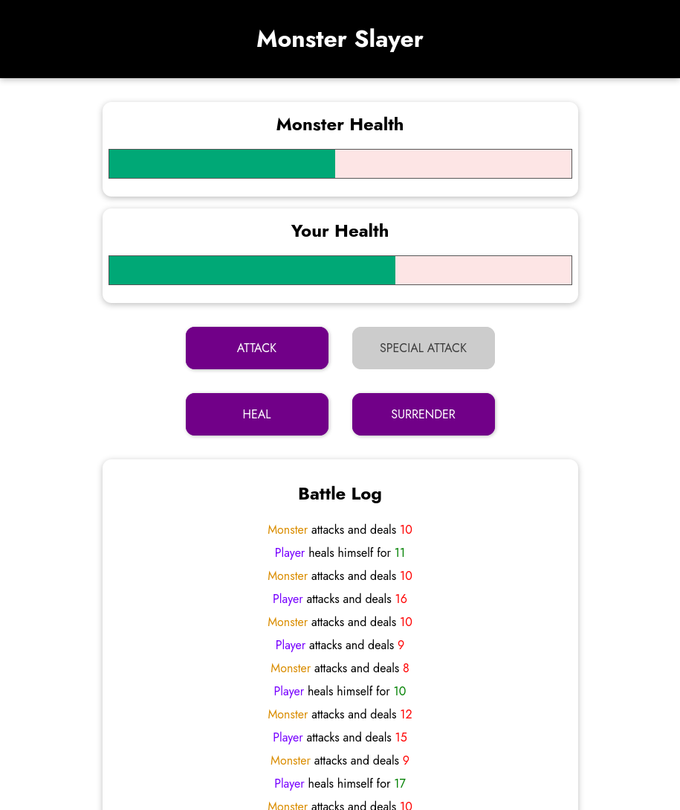
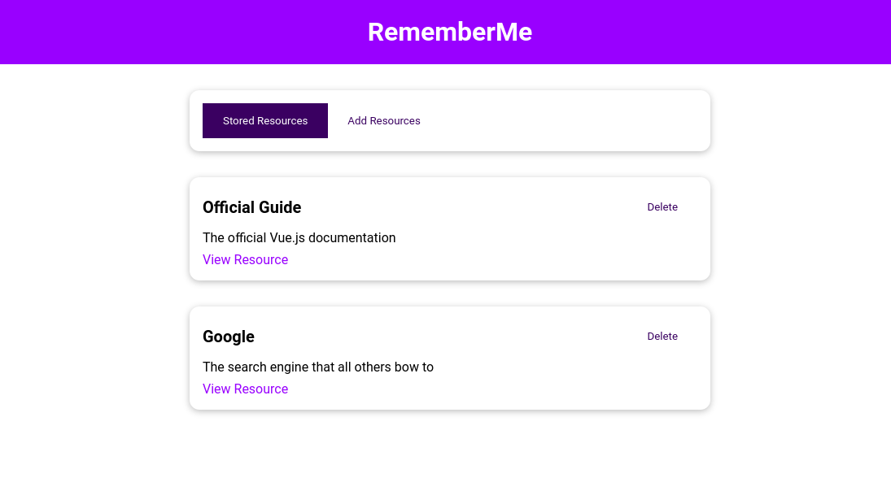
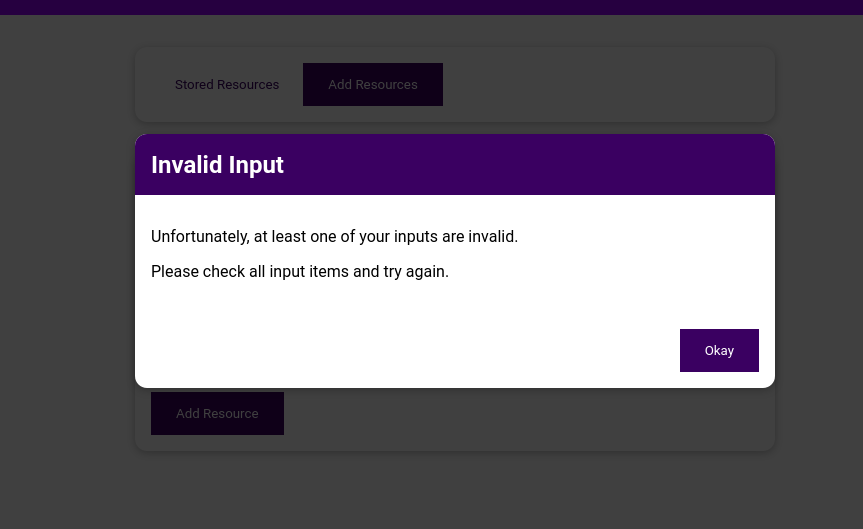

# vuePlayground

Vue - The Complete Guide - <a href="https://www.udemy.com/course/vuejs-2-the-complete-guide/">Udemy Course</a> by Maximilian Schwarzmüller

# Module2 -- Basics & Core Concepts

<ul>
  <li>Interpolation and basic data binding</li>
  <li>Methods, computed, watch</li>
  <li>Event modifiers // bindings</li>
  <li>v-bind // v-on</li>
  <li>Dynamic Styling</li>
  <li>CSS classes dynamically & array syntax</li>

</ul>

# Module3 -- Rendering Conditional Content

<ul>
  <li>Conditional Content</li>
  <li>v-if v-else</li>
  <li>v-for</li>
  <li>Rendering lists/conditional list & keys</li>
</ul>

# Module4 -- Monster Slayer

<li>Monster Slayer a review of the previous 2 modules!</li>

# Module5 -- Vue LifeCycle && Dom Updating

<ul>
  <li>Vue Lifecycle</li>
  <li>Multiple Apps</li>
  <li>How Vue updates the DOM</li>
  <li>Vue Hooks</li>
</ul>

# Module6 -- Component Intro

<ul>
  <li>Vue Component Introduction</li>
  <li>Custom HTML Tags</li>
  <li>Much more excited seeing this</li>
</ul>

# Module7 -- Vue CLI

<ul>
  <li>Vue CLI</li>
  <li>New App Structure</li>
  <li>Creating components 2.0</li>
  <li>Single file components</li>
</ul>

# Module8 -- Component Communication

<ul>
  <li>Intro to Props</li>
  <li>Unidirectional Data flow</li>
  <li>Dynamic Props // Emitting Custom Events</li>
  <li>Component Communication</li>
  <li>Provide && Inject</li>
</ul>

# Module9 -- Component Overview

<ul>
  <li>Global vs Local components</li>
  <li>Slots</li>
  <li>Scoped styles // Slot scope</li>
  <li>Scoped Slots</li>
  <li>Teleporting elements</li>
</ul>

# Module10 -- Learning Resources App

<li>A review and practice project covering the previous modules</li>

# Module11 -- Forms

<ul>
  <li>v-model and inputs</li>
  <li>v-model modifiers</li>
  <li>Dropdowns, checkboxes, and radio buttons</li>
  <li>Custom control components</li>
  <li>V-model with custom components</li>
</ul>

# Module12 -- Sending HTTP Requests

<ul>
  <li>Firebase backend for http requests</li>
  <li>Http verbs review</li>
  <li>Fetch "vs" axios</li>
  <li>Same ole same ole here // good review</li>
</ul>

# Module13 -- Routing

<ul>
  <li>Router setup && navigating with router-link</li>
  <li>Dynamic Segments (passing data with route params)</li>
  <li>Redirecting && Nested routes</li>
  <li>Mulitple routes with names router-views</li>
  <li>Scroll Behavior</li>
  <li>Nav Guards</li>
  <li>Route leaving Guards && Metadata</li>
</ul>

# Module14 -- Animations

<ul>
  <li>Animation Basics</li>
  <li>Transition Component</li>
  <li>Javascript Transitions</li>
</ul>

# Module15 -- VueX

<ul>
  <li>Global State Management</li>
  <li>Connecting componenets to state</li>
  <li>Mutations</li>
  <li>Getters</li>
</ul>

# Module16, 17, and 18 -- Coach Finder App

<ul>
  <li>Routing</li>
  <li>Using base componenets</li>
  <li>Forms</li>
  <li>Creating and Managing Coaches</li>
  <li>Transitions</li>
  <li>VueX and Authentication</li>
</ul>
